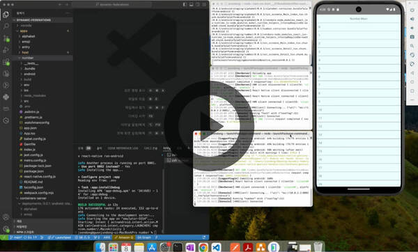
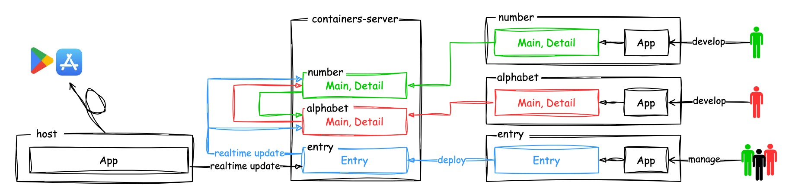

# Dynamic Module Federation Example

## 목차

1. [요약](#요약)
2. [최종 결과물 영상](#최종-결과물-영상)
3. [문제 인식](#문제-인식)  
   3-1. [업데이트 = 재시작](#업데이트--재시작)  
   3-2. [재시작이 필요한 업데이트의 문제점](#재시작이-필요한-업데이트의-문제점)
4. [해결 방법](#해결-방법)  
   4-1. [Module Federation 도입](#module-federation-도입)  
   4-2. [Module Federation 변조](#module-fedration-변조)
5. [프로젝트 구조](#프로젝트-구조)
6. [사용예](#사용예)
7. [마치며](#마치며)

> [Module Federation 분석](./docs/module-federation.md)  
> [repack, Module Federation 분석](./docs/repack.md)  
> [react-native-dynamic-module-federation 구현](./docs/react-native-dynamic-module-federation.md)

## 요약

리액트 네이티브 앱을 **재실행없이, 기존 상태(스크린 스택 등)를 유지하면서 부분 업데이트**할 수 있는 방법을 소개합니다.

## 최종 결과물 영상

배포 서버는 `localhost:4000`에서 작동하고, `entry`, `number`, `alphabet` 앱이 업로드되어 있는 상태입니다.

1. `host` 앱과 `number` 앱을 독립적으로 실행
2. `number` 앱을 로컬에서 변경하고 확인
3. `number` 앱을 번들링하여 배포 서버에 업로드
4. `host` 앱에서 업데이트 버튼을 클릭하면, 재시작 없이 `number` 앱을 제외한 나머지 상태(네비게이션 스택 등)는 유지하면서 `number` 앱 컴포넌트만 교체

[](https://youtu.be/UJLjYEa0_QE)  
클릭하면 유튜브에서 재생

### 테스트 환경

- `CPU: Intel`
- `OS: MacOS 14.4.1` (맥OS 전용 스크립트 명령어를 사용해서 윈도우, 리눅스에서 사용 불가)
- `Node: 20.12.1`
- `JDK: OpenJDK 17.0.11` (Microsoft)
- `ruby: 2.7.6`
- `모바일 OS: 안드로이드 API 34` (iOS는 의존성 설치 후 개발 전 한 번만 실행하고 테스트 안했습니다.)
- `장치: 에뮬레이터` (localhost:4000번을 서버로 이용했기 때문에, 실제 장치는 localhost 연결하는 작업 필요)

### 테스트 방법

스크립트를 만들어 놓았기 때문에, 루트 경로에서 실행하면 됩니다.

1. `npm i` (모든 라이브러리 및 앱의 의존성 설치)
2. `npm run deploy:android:all` 모든 앱 배포 (배포 서버 자동 실행)
3. `npm run android:host:staging host` (`host` 앱 실행, 실패하면 에뮬레이터가 완전히 켜질 때까지 기다렸다 다시 실행)
4. `npm run android:host:staging number` (`number` 앱 실행)
5. `apps/number/src/constants.ts 파일에서` 앱 고유색 변경
6. `npm run deploy:android number` (`number` 앱 배포, 버전 자동 지정)
7. `host` 앱에서 `앱 업데이트` 버튼 클릭

## 문제 인식

### 업데이트 = 재시작

스토어에서 앱을 업데이트하면 앱이 종료됩니다.

[`codepush`](https://github.com/microsoft/react-native-code-push?tab=readme-ov-file#how-does-it-work), [`Module Federation`](./docs/module-federation.md)같이 스토어를 통하지 않는 업데이트 방법도 있습니다.

`codepush`는 앱이 업데이트되면 재시작이 필요합니다.

`Module Federation`도 앱을 분리/병합하는 방법만 제공해 줄 뿐이고, **한 번 로드한 미니 앱은 앱이 종료할 때까지 계속 유지**됩니다.

결국 대부분의 경우 **변경사항을 적용하기 위해선 재시작이 필요**했습니다.

### 재시작이 필요한 업데이트의 문제점

#### 1. 근본적인 문제

대부분의 앱이 업데이트 후 재시작이 필요한 이유는 런타임에 코드 일부를 바꾸는 것은 너무 위험하기 때문입니다.

그리고 이것은 **변경사항을 바로 반영할 수 없다**는 것을 의미합니다.

> 전 회사에서 푸시 알람을 통하여 사용자들을 버그가 수정된 페이지로 이동시키고 싶은데, 업데이트가 완료되지 않은 사용자들 앱에서는 작동하지 않기 때문에, 업데이트 비율이 일정 수치가 될 때까지 손가락 빨고 기다린 적이 있습니다.
>
> `codepush`로 강제 업데이트를 설정해도, 앱이 실행되기 전까지는 업데이트가 있는지도 모르기 때문에, 이런 문제는 여전히 발생합니다.

#### 2. 기존 상태 소실

가장 대표적인 예는 사용자의 히스토리(스크린 스택)입니다.

결국 사용자에게 불편함을 야기합니다.

## 해결 방법

### Module Federation 도입

`Module Federation`은 여러 개의 미니 앱이 하나의 앱을 구성합니다.

미니 앱은 **필요할 때 필요한 만큼만 로드할 수** 있습니다.

> `codepush`는 한 개의 번들링 파일로 작동하기 때문에, 고려할 여지가 없었습니다.

하지만 **한 번 로드한 미니 앱은 앱이 종료할 때까지 계속 유지**됩니다.

### Module Fedration 변조

하지만 `Module Federation`이 만들어낸 파일에 약간의 코드만 추가하면, **앱 단위로 런타임에 삭제하고 다시 로드할 수 있을 것 같았습니다.**

이를 위해 [`react-native-dynamic-module-federation`](./modules/react-native-dynamic-module-federation/README.md) 라이브러리를 직접 만들었습니다.

해당 라이브러리에서 제공하는 `webpack` 플러그인으로 **로드된 앱을 삭제하는 코드를 `Module Federation`이 만들어낸 파일에 추가합니다.**

이 코드를 사용하여 앱 버전이 변경이 감지되면, 기존 앱을 삭제하고, 새로운 앱을 로드합니다.

## 프로젝트 구조



`entry`, `alphabet`, `number` 앱에서 노출하는 모듈들이 번들링되어 `containers-server`에 배포(`deploy`)됩니다.

`host` 앱뿐만 아니라, 모든 앱은 `containers-server`에서 노출하는 모듈을 **실시간으로에 다운받아 업데이트**(`realtime update`)할 수 있습니다.

`host`, `entry` 앱은 팀에서 공통으로 관리(`manage`)하고, `alphabet` 앱 개발자, `number` 앱 개발자가 **각자 자신이 담당한 앱을 배포(`deploy`)까지 담당하는 상황을 가정**했습니다.

### [host](./apps/host/README.md)

스토어 배포를 가정한 앱입니다.

`entry` 앱을 로드하는 것 이외에 아무런 로직이 없습니다.

### [entry](./apps/entry/README.md)

다른 앱을 로드합니다.

이것을 `Host`에서 하지 않은 이유는 위에서 언급한 `Host` 앱으로의 **접근 제한**과, `Host` 앱은 **변경하기 위해 스토어 배포가 필요하기 때문입니다.**

### [alphabet](./apps/alphabet/README.md), [number](./apps/number/README.md), [emoji](./apps/emoji/README.md)

특정 도메인을 담당하는 미니 앱들입니다.

### [shared](./shared/README.md)

`shared` 모듈은 편의를 위해 라이브러리처럼 만들긴 했는데, `해당 프로젝트에 100% 의존`하는 설정값, 설정값을 반환하는 함수들의 모음입니다.

그래서 `shared` 모듈은 `root`에 있지만, `react-native-dynamic-modules` 라이브러리는 로컬 모듈 저장 공간인 `modules` 폴더에 있습니다.

### [contaienrs-server](./containers-server/README.md)

앱을 배포하고, 배포 정보를 제공합니다.

배포된 파일은 `containers-server/deployments` 경로에 저장되고, `/` 경로에서 호스팅됩니다.

배포 파일은 `S3` 등에서 호스팅될 수도 있습니다.

## 사용예

`DynamicImportManager` 객체를 사용하여 리액트 내외부 어디에서든지 `refreshContainers` 또는 `refreshContainer` 메서드를 사용하여 앱(`container`)를 업데이트할 수 있습니다.

[예를 들어 `host` 앱에서](./apps/host/App.tsx#L23-L38)는 앱이 백그라운드에서 포그라운드로 이동했을 때, `refreshContainers` 메서드를 호출합니다.

```
const manager = new DynamicImportManager({
  fetchContainers,
  fetchContainer,
  errorManager: ErrorManager,
});

let appState = AppState.currentState;

// inactive 무시
AppState.addEventListener('change', nextAppState => {
  if (appState === 'background' && nextAppState === 'active') {
    manager.refreshContainers();
  }

  appState = nextAppState;
});
```

위와 같이 설정하면 사용자가 화면을 보고 있을 때도 앱을 부분 업데이트할 수 있기 때문에, [재시작이 필요한 업데이트의 문제점](#1-근본적인-문제)에서 예로 들었던 사례를 해결할 수 있습니다.

## 마치며

해당 프로젝트를 완료하기 위해 필요했던 [`Module Federation`](https://velog.io/@joondong2/Module-Federation-%EB%B6%84%EC%84%9D), [`repack`](https://velog.io/@joondong2/repack%EA%B3%BC-Module-Federation) 분석과 [`react-native-dynamic-module-federation`](./docs/react-native-dynamic-module-federation.md) 구현에 대한 내용은 내용이 너무 많아 다른 페이지로 분리했습니다.

보통 어떤 라이브러리를 사용할 때 내부 코드까지 분석하지는 않지만, **앱의 기반이 되는 방법의 도입 여부를 결정할 때**는 내부 동작까지 알아야 할 것 같아 꽤 상세하게 분석했습니다.

저는 분석과 테스트를 거쳐 이 글을 작성한 거라 `Module Federation`을 처음 접해본 분들을 얼마나 이해시킬 수 있을지 걱정입니다.

경력의 대부분을 리액트 네이티브로 개발해 오면서, 최근 앱이 커질 수록 `관리`와 `성능`에 대한 한계를 느꼈습니다.

이 중에서 `관리`에 대한 이슈는 리액트 네이티브만의 문제는 아닐 것입니다.

`Module Federation`은 자바스크립트라는 특별한 생태계를 통해서 `관리`에 대한 문제를 해결할 수 있는 멋진 방법이라고 생각합니다.

그리고 이번 프로젝트는 **`Module Federation` 기능을 업그레이드**하여 사용할 수 있는 프로젝트 정도로 봐주셔도 될 것 같습니다.

감사합니다.
