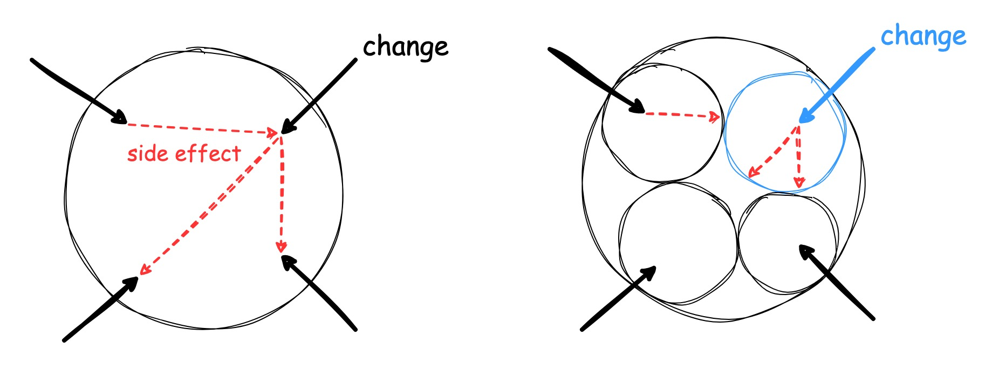
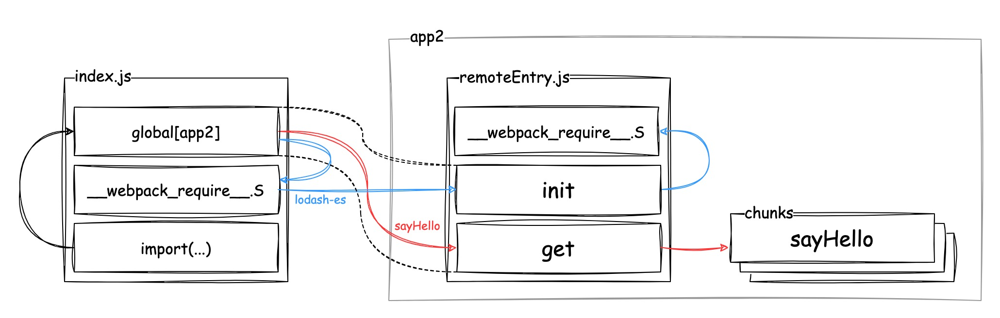
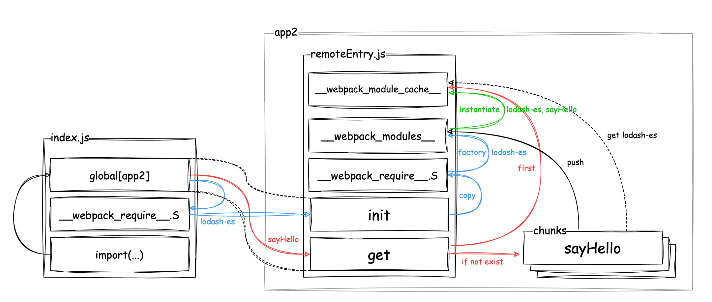

# Module Federation

코드를 일일이 설명하면 저도 힘들고 보는 사람도 힘들기 때문에, 간단한 예제로 **전반적인 실행 흐름과 그 사이의 중요한 로직 위주**로 설명하겠습니다.

## 목차

1. [필요성](#필요성)
2. [예제 코드](#예제-코드)
3. [실행 흐름](#실행-흐름)
4. [정리](#정리)
5. [마치며](#마치며)

## 필요성

모든 앱에는 항상 변경(`change`)이 발생합니다.

그리고 **앱의 규모가 커질 수록** 변경에 따른 부수효과(`side effect`)가 발생할 가능성이 커집니다.

**앱을 여러 개의 도메인으로 분리**하고, **각 도메인을 하나의 미니 앱이 담당**한다면, **개발자가 신경써야할 부분과, 실수 가능성을 최소화할 수 있을 것**입니다.



참고

- [거대한 서비스 쪼개서 마이크로 프런트엔드 만들기 - NHN 클라우드](https://www.youtube.com/watch?v=BWyCH_fv81g&list=WL&index=99)
- [Webpack 5 Module Federation으로 Micro-Frontends 운영하기 - FE Conf](https://www.youtube.com/watch?v=0Eq6evGKJ68&list=WL&index=100)

## 예제 코드

`app2`가 노출하는 `sayHello` 모듈을 `app1`이 가져와 사용하고, [`lodash-es` 라이브러리를 앱끼리 공유](../apps/host/webpack.config.mjs#L232)하는 상황을 예로 들어보겠습니다.

### app2/src/sayHello.js

`app2`는 [`sayHello` 모듈을 노출](../apps/number/webpack.config.mjs#L235-L240)합니다.

`sayHello` 모듈은 `{ sayHello: () => { /* ... */ } }` 형태입니다.

```
import { trim } from 'lodash-es'

export const sayHello = () => {
  console.log(trim("Hello from app2!"));
};
```

### app1/index.js

```
import { trim } from "lodash-es"; // 공유 모듈

// app2의 sayHello 호출
import("app2/sayHello").then(({ sayHello }) => {
  console.log("app2");
  sayHello();
});
```

## 실행 흐름

어떤 모듈을 노출하는 앱은 `Module Federation` 플러그인에 의해 `remoteEntry.js`와 이외 모듈을 로드할 수 있는 파일로 번들링됩니다.

> 예를 들어, 예제 코드에서 `app2`는 `remoteEntry.js` 파일과 `sayHello.js`의 번들링 파일인 `src_sayHello_js.js` 파일로 번들링됩니다.

그리고 어떤 앱에 모듈을 요청할 때는 해당 앱의 **`remoteEntry.js`를 로드하는 것부터 시작**합니다.

<a name="entry-object"></a>

각 앱의 `remoteEntry.js` 파일은 실행되면, `global`에 다음과 같은 해당 앱의 `엔트리 객체`를 생성합니다.

```
{
  get: (moduleId) => { /* ... */ },
  init: (shared) => { /* ... */ }`,
}
```

> 예를 들어, 예제 코드에서 `app2`는 `global['app2']`에 `{get: ..., init: ...}` 객체를 생성합니다.

그리고 어떤 앱에 대한 모든 요청은 해당 앱의 엔트리 객체의 `get` 메서드를 통해 이루어집니다.

`init` 메서드는 엔트리 객체의 내부 데이터를 초기화하기 위해 사용됩니다.

> 엔트리 모듈을 `global`에 노출할 때 한 번 호출됩니다.

`init` 메서드에 `caller`가 공유할 라이브러리도 함께 입력됩니다.

어떤 사이트에 접속해서 `Module Federation`으로 번들링된 `app1`의 `index.js`를 다운받아 로드했다고 가정해 보겠습니다.

<a name="import-summary"></a>

[예제 코드](#app1indexjs)의 `import("app2/sayHello")`는 `Module Federation` 플러그인에 의해 다음 동작으로 변경됩니다.

1. `app2`의 `remoteEtnry.js`를 로드
2. `remoteEtnry.js`를 로드하면 생성된 `app2`의 엔트리 객체의 `init` 메서드를 실행(이때 `lodash-es` 공유 라이브러리를 같이 보냅니다.)
3. `get` 메서드로 `sayHello` 모듈을 로드



> `__webpack_require__.S`는 각 앱마다 공유 모듈을 얻기 위한 `factory` 함수를 저장해 놓는 객체입니다.

<a name="import-detail"></a>

위의 그림은 1~3 동작 흐름만 표시해 놓은 것이고, 내부적으로는 좀 더 복잡하게 동작합니다.



`__webpack_modules__`는 키가 모듈 `ID`이고 값이 해당 **모듈 객체를 생성**하는 모듈 `Resolver`인 객체입니다.

<a name="module-resolver"></a>

`__webpack_modules__`에는 앱에서 사용하는 모든 모듈의 `Resolver`가 저장됩니다.

> `Resolver`는 모듈 객체를 생성하는 함수입니다.

엔트리 객체의 `init` 메서드를 통해 전달된 공유 모듈의 `factory` 함수도 실행되면, 해당 모듈의 `Resolver`가 `__webpack_modules__`에 저장됩니다.

`__webpack_module_cache__`는 모듈 `Resolver`에 의해 생성된(`instantiate`) **모듈 객체가 저장된 객체**입니다.

엔트리 앱의 `get` 메서드는 `__webpack_module_cache__`에서 모듈 객체를 찾아 반환하는데, 없다면 다음 동작을 수행합니다.

1. 원하는 모듈이 포함된 파일을 로드
2. 파일에 포함된 모듈의 `Resolver`를 **webpack_moduels**에 `push`
3. `Resolver`로 모듈 객체를 만들어 `__webpack_module_cache__`에 입력하고 반환

여기서 2번은 [`react-native-dynamic-module-federation`](./react-native-dynamic-module-federation.md) 에서 기존 앱을 삭제하는 방법을 설명할 때 언급되기에, 이 부분만 좀 더 자세히 살펴보겠습니다.

`sayHello` 모듈이 포함된 `src_sayHello_js.js` 파일은 다음과 같이 번들링됩니다.

```
(self["webpackChunkapp2"] = self["webpackChunkapp2"] || [])
.push( // remoteEntry.js에서 오버라이드
  [
    ["src_sayHello_js"], // 파일 ID
    {∂
      // { 모듈 ID: 모듈 Resolver }
      "./src/sayHello.js": (__unused_webpack_module, __webpack_exports__, __webpack_require__) => {
        // 모듈 Resolver 내용 ↓ ... 일단 여기선 내용은 신경쓰지 않겠습니다.
        __webpack_require__.r(__webpack_exports__);

        __webpack_require__.d(__webpack_exports__, {
          sayHello: () => sayHello
        });

        var lodash_es__WEBPACK_IMPORTED_MODULE_0__ = __webpack_require__("webpack/sharing/consume/default/lodash-es/lodash-es");
        var lodash_es__WEBPACK_IMPORTED_MODULE_0___default = __webpack_require__.n(lodash_es__WEBPACK_IMPORTED_MODULE_0__);

        const sayHello = () => {
          console.log((0, lodash_es__WEBPACK_IMPORTED_MODULE_0__.trim)("Hello from app2!"));
        };
      }
    }
  ]
);
```

좀 복잡해 보이는데, `파일 ID`와 `{ 모듈 ID: 모듈 Resolver }`로 구성된 배열입니다.

해당 배열을 `self["webpackChunkapp2"].push`에 넣어 실행하면 모듈 `Resolver`가 `__webpack_modules__`에도 입력되는데, 이것은 `remoteEntry.js`에서 `self["webpackChunkapp2"].push` 메서드를 오버라이드했기 때문입니다.

<a name="webpackjsonpcallback"></a>

```
(() => {
  var webpackJsonpCallback = (parentChunkLoadingFunction, data) => {
    var [chunkIds, moreModules, runtime] = data; // moreModules가 위에 src_sayHello_js.js 파일의 { 모듈 ID: 모듈 Resolver }

    var moduleId, chunkId, i = 0;

    // moreModules를 __webpack_modules__(=__webpack_require__.m)에 입력
    if (chunkIds.some((id) => (installedChunks[id] !== 0))) {
      for (moduleId in moreModules) {
        if (__webpack_require__.o(moreModules, moduleId)) {
          __webpack_require__.m[moduleId] = moreModules[moduleId];
        }
      }
      if (runtime) var result = runtime(__webpack_require__); // 위의 예에선 없음
    }

    // 원래 chunkLoadingGlobal.push ... self["webpackChunkapp2"] 배열에 data 입력
    if (parentChunkLoadingFunction) parentChunkLoadingFunction(data);

    // ...
  }

  // self는 해당 모듈 전용 global
  var chunkLoadingGlobal = self["webpackChunkapp2"] = self["webpackChunkapp2"] || [];

  // self["webpackChunkapp2"]에 있던 모든 모듈을 __webpack_modules__에 다시 로드
  // 이 부분 때문에, container를 지우기 위해서 global[app]뿐만 아니라, chunkLoadingGlobal을 초기화해 주어야 한다.
  chunkLoadingGlobal.forEach(webpackJsonpCallback.bind(null, 0));

  // self["webpackChunkapp2"].push 오버라이드
  // bind의 첫 번째 매개변수에 원본 push 보존
  chunkLoadingGlobal.push = webpackJsonpCallback.bind(null, chunkLoadingGlobal.push.bind(chunkLoadingGlobal));
})();
```

## 정리

1. `remoteEntry.js` 파일과 나머지 모듈을 포함하는 파일들로 빌드

   > 모듈은 `remoteEntry.js`에 내장될 수도 있고, 다른 파일로 분리되어 빌드될 수도 있습니다.

2. 원하는 앱의 `remoteEntry.js` 로드 → 해당 앱의 `엔트리 객체`가 `global`에 등록

3. 원하는 앱의 엔트리 객체의 `init` 메서드를 호출하여 엔트리 객체 초기화 (여기서 공유할 라이브러리 모듈 전달)

4. 원하는 앱의 엔트리 객체의 `get` 메서드를 사용하여 해당 앱이 노출하는 모듈(컴포넌트 등) 로드

결론적으로 빌드할 때 분리되었던 모듈이, 필요에 따라 `remoteEntry.js`의 `__webpack_module_cache__`로 다시 모이는 구조입니다.

> 각 앱이 다른 앱의 모듈을 얻기 위해 사용하는 정보(`모듈 ID`, `파일 ID`, `remoteEntry.js` 주소) 등은 `Module Federation` 설정값, 번들링 규칙을 통해 하드코딩되어 컴파일됩니다.

## 마치며

사실 번들링된 코드를 보면 코드량이 상당히 많습니다.

전체 내용은 `dynamic-module-federation-example/apps/number`에서 `npm run bundle:android`를 실행하면 생성되는`dynamic-module-federation-example/apps/number/build/generated/android/number.container.bundle` 파일에서 확인할 수 있습니다.

> 모바일에선 `remoteEntry.js` 파일 이름 대신 `${앱이름}.container.bundle`이 사용됩니다.

저는 <a href="https://github.com/JoonDong2/dynamic-module-federation-example" target="_blank">`dynamic-module-federation-example`</a> 프로젝트를 진행하기 위해 기존에 로드된 앱을 삭제하고, 새로 로드하기 위해 어떤 부분을 변경해야 하는지 알아야 했기에 일일이 분석했지만, 그렇지 않다면 너무 복잡하기 때문에, 중요하다고 생각하는 부분만 그림으로 위주로 설명했습니다.

좀 더 상세한 내용은 실제 번들링된 파일을 직접 분석해 보거나, 아래 링크를 참조해 보면 좋을 것 같습니다.

- [Webpack Module Federation 도입 전에 알아야 할 것들 - 카카오 FE 기술 블로그](https://fe-developers.kakaoent.com/2022/220623-webpack-module-federation/)
- [Module Federation의 컨셉과 작동 원리 이해하기 - 김맥스 블로그](https://maxkim-j.github.io/posts/module-federation-concepts/)
